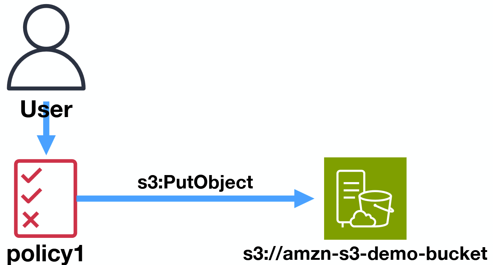

# 這是我第一篇 AIS3 好厲害學習筆記
---

## 重點摘要：雲端中繼資料服務 (Metadata Services)

在雲端架構滲透測試或 SSRF (Server-Side Request Forgery) 攻擊中，中繼資料服務往往是取得雲端環境權限的關鍵突破口。以下整理了常見的兩個目標：

| URL | Detail | use (攻擊/應用情境) |
| --- | --- | --- |
| `169.254.169.254` | AWS IMDS (Instance Metadata Service) 適用於 EC2 Host | 當後端伺服器存在 SSRF 漏洞時，可用來向 LAN 伺服器取得執行個體的中繼資料與暫時憑證。 |
| `169.254.170.2` | ECS Task Metadata 適用於 ECS (Serverless / 容器服務) | 當主機封鎖了 `169.254.169.254` 時，ECS 容器可改透過此端點（通常具備版本號如 `/v2` 或 `/v3`）查詢任務層級的容器資訊。 |

---

## IAM (Identity and Access Management) 核心概念

* **基本定義**：IAM 簡單來講就是讓 EC2（或其他 AWS 服務）可以**無需在程式碼中寫死密碼 / Access Key**，就能安全地訪問其他 AWS 內部服務的機制。
* **資安觀念**：如果 IAM Role 的權限設定過大（例如賦予過度寬鬆的 `AdministratorAccess`），一旦 EC2 或容器遭受入侵，攻擊者便能透過 IMDS 輕易提取憑證，進而接管整個雲端環境。